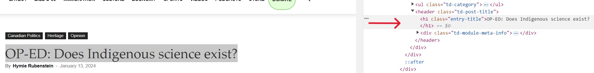

## This post is in the process of being written. Stay tuned! 

### *Cue suspenseful music.* 

### Overview

In this post, we'll walk through an R script designed to scrape multiple news articles from a website. This script is beginner-friendly and serves as a great introduction to web scraping. I’ll guide you through how the script works, covering everything from setting it up to ensuring responsible scraping practices. You’ll learn how the script efficiently handles common issues and exports the data into a format that's easy to analyze.

### Note

The website used in this script as an example was selected based on a specific request from a reader. The content of this website does not reflect my personal views or endorsements.

### Features

The script includes features such as:

- **Multi-page Scraping:**<br> 
The script scrapes multiple articles in a single run to save time and effort.

- **Error Handling:**<br> 
It manages network issues and missing information through built-in mechanisms to ensure smooth operation.

- **CSS Selector Usage:**<br> 
The script targets specific webpage elements and flexibly adapts to different site structures.

- **Responsible Scraping:**<br> 
It adds delays between scraping requests to prevent server overload and to ensure ethical scraping practices.

- **Easy Data Export:**<br> 
The script automatically saves scraped data into a tidy CSV format, which makes it ready for analysis.

- **Understandable Code:**<br> 
The script is designed with detailed comments and a clear, step-by-step organization. Its modular structure makes it easy for beginners to follow and understand.

### What You’ll Need To Start Your Scraping Journey

1. To follow along with this tutorial, you'll need access to R. You can run the script using [RStudio](https://posit.co/products/open-source/rstudio/) or [Posit Cloud](https://posit.cloud/), a cloud-based version of R that runs directly in your Internet browser. Posit Cloud is particularly beginner-friendly and is what I use for my own work, as it eliminates the need for software installation and gets you coding quickly.

2. Basic familiarity with running R scripts will be helpful as you work through the example.

3. The package handling script is covered in Parts I and II of the code linked in the GitHub Gist. The script automates the installation and loading of required R packages (or libraries), provides clear feedback on their status, captures any errors, and ensures all necessary dependencies are managed. For more details on how this script works, you can check out [this blog post](https://lebriggs.com/blog/pkghandling/). I recommend running the package handling script first to ensure everything is set up correctly before proceeding.

4. Grab a latte from your favourite café — this tutorial is best enjoyed if you are fully caffeinated!

### Show Me The Code

You can access the script by clicking on the **R SCRIPT** button, which is located just below the date at the top of the page. The link will take you to a GitHub Gist page.

### Practice Responsible Scraping

Explain the importance of responsible web scraping, including the use of delays between requests and adherence to website policies.

### Getting Started With The Script

1. **Run the Package Handling Script (Part I):** <br>
 Begin by running Part I of the package handling script from the linked GitHub Gist to ensure that all necessary R packages are installed and loaded. This step sets up your environment for the first session. Part II of the script is only needed if you want to load the packages in subsequent R sessions.

2. **Review the Overview in Part III:** <br>
Before diving into the web scraping process, review the list of steps provided at the beginning of Part III of the script. This overview will give you a clear understanding of how the script is structured and what it will accomplish.

3. **Run the Full Script Once:** <br>
It’s a good idea to run the full web scraping script (starting in Part III) once as-is. This initial run will help you familiarize yourself with the script’s flow and ensure that everything is functioning correctly. The five example URLs included in the script are:
   - An invalid URL for testing error handling.
   - A store URL with only images, to test handling of pages with no text content.
   - Three working URLs for actual scraping.

4. **Check the Output:** <br>
After the script has finished running, check the output CSV file to verify that the data was scraped correctly. If you encounter any issues, refer to the error messages or logs provided by the script for troubleshooting.
    - The message **"All available data was saved to 'articles.csv'"** in the Console indicates that the file is ready to be downloaded. 
  
5. **Customize the Script (Optional):** <br>
After successfully running the script and reviewing the output, you can customize it to fit your specific needs. If you’re replacing the example URLs with ones from a different website, you’ll likely need to adjust the CSS selectors. This will ensure the script correctly targets the elements you want to scrape for your specific project.

### Understanding CSS Selectors For Web Scraping

In this section, we’ll learn how to use CSS selectors to extract key elements like the title, author, date, and content from an article on a website.

A **CSS selector** is a pattern that targets specific HTML elements based on their tags, classes, IDs, or other attributes. We use CSS selectors in the R script because they offer more flexibility than other methods, such as XPath. This flexibility is crucial because CSS selectors can easily adapt to changes in a webpage's structure, making them a reliable choice for scraping multiple pages from a website.

We’ll use the first "real" URL in the script as our example and break down each selector to explain why it works and how it helps us gather the necessary data.

- **Inspect Feature:** <br>

Use your Internet browser's **Inspect** feature to identify the elements you want to scrape and their associated classes or tags. 

To access the Inspect feature:
  
- **On Windows:** Right-click on any part of the webpage and select **Inspect** (or **Inspect Element**) from the context menu.
  
- **On Mac:** Control-click (or two-finger click on a trackpad) on any part of the webpage and select **Inspect** (or **Inspect Element**) from the context menu.
  
This will open the browser's developer tools, where you can explore the HTML structure and find the selectors you need (see **Figure 1**). In practice, you might have to experiment with different selectors until you find the ones that work best.

|  |
|:--:|
| **Figure 1:** Screenshot of the article's title and its HTML structure in Chrome's Inspect tool. |

#### Example: First URL

The following URL will be used to demonstrate how to extract the title, author, date, and content using CSS selectors:

https://tnc.news/2024/01/13/rubenstein-indigenous-science/

**1. Extracting the Article's Title** <br>

**HTML:**
Highlight the article's title and right-click to select **Inspect** in your browser (e.g., Chrome). This action reveals the corresponding HTML code for the title (see **Figure 1**).

```{r Title Chunk, echo=TRUE, eval=FALSE}

# This is the HTML code that contains the article's title.

<header class="td-post-title">
    <h1 class="entry-title">OP-ED: Does Indigenous science exist?</h1>
</header>

```

**CSS Selector:** <br>
h1.entry-title

**Explanation:** <br>
This CSS selector targets the **h1** tag within the header element that has the class **entry-title**. The **h1** tag usually contains the main title of the article. By specifying the **entry-title** class, the selector effectively targets the correct **h1** tag, ensuring that it selects only the main title and avoids any other **h1** tags on the page.

**2. Extracting the Author’s Name** <br>

**HTML:**

Highlight the author’s name and use **Inspect** to view the relevant HTML code. This will help you locate the **a** tag that contains the author’s name.

```{r Author Chunk, echo=TRUE, eval=FALSE}

# This is the HTML code that contains the author's name.

<div class="td-post-author-name">
    <div class="td-author-by">By</div>
    <a href="https://tnc.news/author/hymierubenstein/">Hymie Rubenstein</a>
    <div class="td-author-line"> - </div>
</div>

```

**CSS Selector:** <br>
.td-post-author-name a

**Explanation:** <br>
This selector finds the **a** tag within the **div** that has the class **td-post-author-name**. The **a** tag contains the author’s name and the link to their profile.

The selector starts with a period (**.**) because it is targeting a class (**td-post-author-name**). In CSS, a period (**.**) before a name indicates that it’s a class selector, meaning it will select elements with that class. For example, **.td-post-author-name a** targets an anchor (**a**) tag within any element that has the **td-post-author-name** class.

Alternatively, the selector for the article title (**h1.entry-title**) doesn’t start with a period (**.**) because it begins with the **h1** tag itself. This selector first targets the **h1** tag, which is an HTML element, and then filters those **h1** tags down to only those that have the **entry-title** class. By targeting the **a** tag within this **div** class, the selector effectively captures the author’s name. The author’s name is always found in this **a** tag on the site.

**3. Extracting the Article's Publication Date** <br>

**HTML:**
Highlight the publication date and use **Inspect** to find the time tag within the HTML structure.

```{r Date Chunk, echo=TRUE, eval=FALSE}

# This is the HTML code that contains the publication date.

<span class="td-post-date">
    <time class="entry-date updated td-module-date" datetime="2024-01-13T08:22:15-05:00">January 13, 2024</time>
</span>

```

**CSS Selector:** <br>
time.entry-date

**Explanation:** <br>
This selector targets the **time** tag with the class **entry-date**, which contains the publication date of the article. In the HTML snippet, the **time** tag has additional classes, **updated** and **td-module-date**. However, specifying just the **entry-date** class is sufficient because it uniquely identifies the correct **time** tag. This approach keeps the selector flexible and less likely to break if the other classes change; thus, ensuring accurate extraction of the publication date.

**4. Extracting the Article's Content**

**HTML:**
In the first paragraph of the article, highlight the first sentence and select **Inspect** in your browser. This reveals the HTML structure containing the paragraphs within the **div** element with the class **td-post-content**.

```{r Content Chunk, echo=TRUE, eval=FALSE}

# This is the HTML code that contains the main content of the article.

<div class="td-post-content tagdiv-type">
    <p>Though promoted for decades in Canada’s universities...</p>
    <p>This attack was reinforced Sept. 18 last year...</p>
    <p>Terming the relation between both...</p>
</div>

```

**CSS Selector:** <br>
div.td-post-content p

**Explanation:** <br>
This selector finds all **p** tags within the **div** element that has the class **td-post-content**. Each **p** tag represents a paragraph in the article. The selector **div.td-post-content p** is effective because it selects all paragraph tags within the main content area, allowing you to extract the full text of the article.

You might wonder why we need the **div** element in this selector when we didn't need it for **.td-post-author-name a**, which targets the author’s name. The reason lies in the specificity and context of what we’re trying to extract.

- **Author Name (.td-post-author-name a):**  
This selector targets the **a** tag within any element that has the class **td-post-author-name**. The class **td-post-author-name** sufficiently narrows down the location of the **a** tag, ensuring accurate selection without needing additional specificity, such as including the **div** element.

- **Article Content (div.td-post-content p):**  
For the article content, we need to select all **p** (paragraph) tags within a specific **div** element that has the class **td-post-content**. The **div** acts as a container for the content, and the paragraphs are nested within it. Including the **div** element in the selector ensures that we're targeting paragraphs specifically from the main content area and not inadvertently selecting paragraphs from other parts of the page, such as the header, footer, or sidebar.

### Error Handling Explained

Discuss the built-in error handling in the script, how it manages network issues and missing data, and why it’s important.

### Saving And Analyzing The Data

Describe how the scraped data is saved into a CSV file and suggest ways to analyze or use the data in other tools.

### Future Improvements

Explore potential enhancements to the script, such as adding new features, improving performance, or integrating with other tools.

### Conclusion

Summarize the key takeaways from the post, and encourage readers to try out the script or suggest further developments.

### Contact

For questions or feedback about this tutorial, please [contact me](/contact). I love hearing from readers!

### Subscribe To New Blog Posts

If you would like to be notified when I sporadically publish a new blog post then please subscribe using [this tiny form](https://dashboard.mailerlite.com/forms/1012938/126123917064537119/share). 
