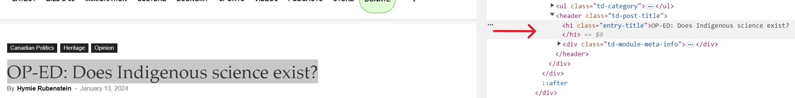

## This post is in the process of being written. Stay tuned! 

### Overview

In this post, we'll explore an R script designed to scrape multiple news articles from a website. Although the script is written at a lower intermediate level, it’s designed with beginners in mind, making it a good introduction to web scraping. The script guides you through the process step-by-step with detailed comments, while this blog post focuses on the more challenging aspects of the code. Whether you're new to web scraping or looking to enhance your skills, you’ll gain a clearer understanding of how web scraping works. This includes learning the logic behind the script, adopting responsible scraping practices, and addressing common challenges such as error handling and data extraction. By the end of this post, you’ll have the skills to scrape data efficiently and export it into a format that’s ready for analysis, allowing you to confidently apply these techniques to your own projects.

### Important Note

The website used as an example in the R script was selected based on a specific request from a reader. It contains content that reflects a far-right perspective, which some folks may find upsetting. While I do not endorse or share the views expressed on this site, I created the script to support a student's learning. I hope that other students can also benefit from the technical skills discussed in this example.

### Features

The script includes several key features:

- **Batch Article Scraping** <br> 
Efficiently scrapes multiple articles in a single run, streamlining the process and saving time.

- **Ethical Scraping Practices** <br> 
Incorporates built-in delays between requests to prevent server overload and promote responsible web scraping.

- **CSS Selector Usage** <br> 
Targets specific webpage elements and adapts flexibly to different site structures.

- **Robust Error Handling** <br> 
Manages network issues and missing data through built-in mechanisms, ensuring a smoother and more reliable scraping process.

- **Easy Data Export** <br> 
Automatically saves scraped data into a tidy CSV format, making it ready for analysis.

- **Understandable Code** <br> 
Written at a lower intermediate level, the script features detailed comments and a clear, step-by-step organization. Its modular approach, combined with the accompanying blog posts, makes it accessible to beginners with a basic understanding of R. It serves as a stepping stone from beginner to intermediate, helping learners enhance their web scraping skills with guided support.

### What You’ll Need To Start Your Scraping Journey

1. To follow along with this tutorial, you'll need access to R. You can run the script using [RStudio](https://posit.co/products/open-source/rstudio/) or [Posit Cloud](https://posit.cloud/), a cloud-based version of R that runs directly in your Internet browser. Posit Cloud is particularly beginner-friendly and is what I use for my own work, as it eliminates the need for software installation and gets you coding quickly.

2. Basic familiarity with running R scripts and writing simple functions in R will be helpful as you work through the example.

3. The package handling code is covered in Parts I and II of the script linked in the GitHub Gist. The script automates the installation and loading of required R packages (or libraries), provides clear feedback on their status, captures any errors, and ensures all necessary dependencies are managed. For more details on how this script works, you can check out [this blog post](https://lebriggs.com/blog/pkghandling/). I recommend running the package handling script first to ensure everything is set up correctly before proceeding.

4. Grab a latte from your favourite café — this tutorial is best enjoyed if you are fully caffeinated! <i class="fa fa-coffee" aria-hidden="true"></i>

### Show Me The Code

You can access the script by clicking on the **R SCRIPT** button, which is located just below the date at the top of the page. The link will take you to a GitHub Gist page.

### Practice Responsible Scraping

Coming soon! Explain the importance of responsible web scraping, including the use of delays between requests and adherence to website policies.

### Getting Started With The Script

1. **Run the Package Handling Script in Part I** <br>
 Begin by running Part I of the package handling script from the linked GitHub Gist to ensure that all necessary R packages are installed and loaded. This step sets up your environment for the first session. Part II of the script is only needed if you want to load the packages in subsequent R sessions.

2. **Review the Overview in Part III** <br>
Before diving into the web scraping process, review the list of steps provided at the beginning of Part III of the script. This overview will give you a clear understanding of how the script is structured and what it will accomplish.

3. **Run the Full Script Once** <br>
It’s a good idea to run the full web scraping script (starting in Part III) once as-is. This initial run will help you familiarize yourself with the script’s flow and ensure that everything is functioning correctly. The five example URLs included in the script are:
   - An invalid URL for testing error handling.
   - A store URL with only images, to test handling of pages with no text content.
   - Three working URLs for actual scraping.

4. **Check the Output** <br>
After the script has finished running, check the output CSV file to verify that the data was scraped correctly. If you encounter any issues, refer to the error messages or logs provided by the script for troubleshooting.
    - The message **"All available data was saved to 'articles.csv'"** in the Console indicates that the file is ready to be downloaded. 

5. **Refer to the Blog Post(s) for In-Depth Explanations** <br>
For a more detailed understanding of how CSS selectors work, how to handle errors effectively, and how to save and analyze the scraped data, be sure to read the corresponding sections in the blog posts. These sections provide step-by-step explanations and examples that can help clarify these more challenging concepts.
  
6. **Customize the Script (Optional)** <br>
After successfully running the script and reviewing the output, you can customize it to fit your specific needs. If you’re replacing the example URLs with ones from a different website, you’ll likely need to adjust the CSS selectors. This will ensure the script correctly targets the elements you want to scrape for your specific project.

### Understanding CSS Selectors For Web Scraping

In this section, we’ll learn how to use CSS selectors to extract key elements like the title, author, date, and content from an article on a website.

A **CSS selector** is a pattern that targets specific HTML elements based on their tags, classes, IDs, or other attributes. We use CSS selectors in the R script because they offer more flexibility than other methods, such as XPath. This flexibility is crucial because CSS selectors can easily adapt to changes in a webpage's structure, making them a reliable choice for scraping multiple pages from a website.

We’ll use the first "real" article's URL from the script as our example and break down each selector to explain why it works and how it helps us gather the necessary data.

#### Inspect Feature

Use your Internet browser's **Inspect** feature to identify the elements you want to scrape and their associated classes or tags. 

To access the Inspect feature:
  
- **On Windows** <br>
Right-click on any part of the webpage and select **Inspect** (or **Inspect Element**) from the context menu.
  
- **On Mac** <br>
Control-click (or two-finger click on a trackpad) on any part of the webpage and select **Inspect** (or **Inspect Element**) from the context menu.
  
This will open the browser's developer tools, where you can explore the HTML structure and find the selectors you need (see **Figure 1**). In practice, you might have to experiment with different selectors until you find the ones that work best.

|  |
|:--:|
| **Figure 1:** Screenshot of the article's title and its HTML structure in Chrome's Inspect tool. |

#### Example: Article 1

The following article will be used to demonstrate how to extract the title, author, date, and content using CSS selectors:

Article 1: https://tnc.news/2024/01/13/rubenstein-indigenous-science/

1. **Extracting the Article's Title** <br>

**HTML** <br>
Highlight the article's title and right-click to select **Inspect** in your browser (e.g., Chrome). This action reveals the corresponding HTML code for the title (see **Figure 1**).


``` r
# This is the HTML code that contains the article's title.

<header class="td-post-title">
    <h1 class="entry-title">OP-ED: Does Indigenous science exist?</h1>
</header>
```

**CSS Selector** <br>
h1.entry-title

**Explanation** <br>

This CSS selector targets the **h1** tag within the header element that has the class **entry-title**. The **h1** tag usually contains the main title of the article. By specifying the **entry-title** class, the selector effectively targets the correct **h1** tag, ensuring that it selects only the main title and avoids any other **h1** tags on the page.

2. **Extracting the Author’s Name** <br>

**HTML** <br>
Highlight the author’s name and use **Inspect** to view the relevant HTML code. This will help you locate the **a** tag that contains the author’s name.


``` r
# This is the HTML code that contains the author's name.

<div class="td-post-author-name">
    <div class="td-author-by">By</div>
    <a href="https://tnc.news/author/hymierubenstein/">Hymie Rubenstein</a>
    <div class="td-author-line"> - </div>
</div>
```

**CSS Selector** <br>
.td-post-author-name a

**Explanation** <br>

This selector finds the **a** tag within the **div** that has the class **td-post-author-name**. The **a** tag contains the author’s name and the link to their profile.

The selector starts with a period (**.**) because it is targeting a class (**td-post-author-name**). In CSS, a period (**.**) before a name indicates that it’s a class selector, meaning it will select elements with that class. For example, **.td-post-author-name a** targets an anchor (**a**) tag within any element that has the **td-post-author-name** class.

Alternatively, the selector for the article title (**h1.entry-title**) doesn’t start with a period (**.**) because it begins with the **h1** tag itself. This selector first targets the **h1** tag, which is an HTML element, and then filters those **h1** tags down to only those that have the **entry-title** class. By targeting the **a** tag within this **div** class, the selector effectively captures the author’s name. The author’s name is always found in this **a** tag on the site.

3. **Extracting the Article's Publication Date** <br>

**HTML** <br>
Highlight the publication date and use **Inspect** to find the time tag within the HTML structure.


``` r
# This is the HTML code that contains the publication date.

<span class="td-post-date">
    <time class="entry-date updated td-module-date" datetime="2024-01-13T08:22:15-05:00">January 13, 2024</time>
</span>
```

**CSS Selector** <br>
time.entry-date

**Explanation** <br>

This selector targets the **time** tag with the class **entry-date**, which contains the publication date of the article. In the HTML snippet, the **time** tag has additional classes, **updated** and **td-module-date**. However, specifying just the **entry-date** class is sufficient because it uniquely identifies the correct **time** tag. This approach keeps the selector flexible and less likely to break if the other classes change; thus, ensuring accurate extraction of the publication date.

4. **Extracting the Article's Content**

**HTML** <br>
In the first paragraph of the article, highlight the first sentence and select **Inspect** in your browser. This reveals the HTML structure containing the paragraphs within the **div** element with the class **td-post-content**.


``` r
# This is the HTML code that contains the main content of the article.

<div class="td-post-content tagdiv-type">
    <p>Though promoted for decades in Canada’s universities...</p>
    <p>This attack was reinforced Sept. 18 last year...</p>
    <p>Terming the relation between both...</p>
</div>
```

**CSS Selector** <br>
div.td-post-content p

**Explanation** <br>

This selector finds all **p** tags within the **div** element that has the class **td-post-content**. Each **p** tag represents a paragraph in the article. The selector **div.td-post-content p** is effective because it selects all paragraph tags within the main content area, allowing you to extract the full text of the article.

You might wonder why we need the **div** element in this selector when we didn't need it for **.td-post-author-name a**, which targets the author’s name. The reason lies in the specificity and context of what we’re trying to extract.

- **Author Name (.td-post-author-name a)** <br> 
This selector targets the **a** tag within any element that has the class **td-post-author-name**. The class **td-post-author-name** sufficiently narrows down the location of the **a** tag, ensuring accurate selection without needing additional specificity, such as including the **div** element.

- **Article Content (div.td-post-content p)** <br>
For the article content, we need to select all **p** (paragraph) tags within a specific **div** element that has the class **td-post-content**. The **div** acts as a container for the content, and the paragraphs are nested within it. Including the **div** element in the selector ensures that we're targeting paragraphs specifically from the main content area and not inadvertently selecting paragraphs from other parts of the page, such as the header, footer, or sidebar.

#### Example: Articles 2 And 3

Repeat the process for [Article 2](https://tnc.news/2024/02/12/a-map-of-every-church-burnt-or-vandalized-since-the-residential-school-announcements4/) 
and [Article 3](https://tnc.news/2024/03/06/stop-releasing-racist-crime-statistics/), comparing the title, author, date, and content elements to those identified in the first article. You’ll find that the CSS selectors are consistent across these articles, which makes the process straightforward and reliable. This consistency is one reason why this website serves as a useful example for learning the basics of web scraping. However, when you work on your own projects, it’s important to experiment with different selectors, as the HTML structure can vary between websites and even between pages on the same site. By adjusting your selectors, you can ensure that you accurately capture the data you need, even when the structure is inconsistent.

### Incorporating The CSS Selectors Into The R Script

This section will guide you through setting up the CSS selectors and incorporating them into your scraping function to accurately extract the elements you need from each article. It corresponds to **Part III, Step 2** of the script, where we'll focus on using the previously identified selectors to pull key data points like the title, author, date, and content.

1. **Set Up the Selectors** <br>

First, we’ll define the CSS selectors in our R script. This means creating variables for each selector, so it’s easy to reference them later in the code. For example:


``` r
# Define CSS Variables for each element we want to scrape

title_selector <- "h1.entry-title"           # CSS selector for the article's title
author_selector <- ".td-post-author-name a"  # CSS selector for the author's name
date_selector <- "time.entry-date"           # CSS selector for the publication date
content_selector <- "div.td-post-content p"  # CSS selector for the article's content
```

By setting up these selectors as variables, we make our code more organized and easier to modify later if needed.

2. **Incorporate the Selectors into the Scraping Function**

Next, we’ll integrate these selectors into our scraping function. This is where the magic happens! We’ll update the function to use the selectors, so the script knows exactly which elements to pull from each page.

Here’s the part of the scraping function that uses the CSS selectors:


``` r
scrape_page <- function(url) {
  # Read the HTML content of the page
  page <- rvest::read_html(url, encoding = "UTF-8")  # Load the webpage with UTF-8 encoding

  # Extract the title, author, date, and content using the predefined CSS selectors
  title <- rvest::html_node(page, css = title_selector) %>% rvest::html_text(trim = TRUE)   # Extract and clean the title
  author <- rvest::html_node(page, css = author_selector) %>% rvest::html_text(trim = TRUE) # Extract and clean the author's name
  date <- rvest::html_node(page, css = date_selector) %>% rvest::html_text(trim = TRUE)     # Extract and clean the publication date
  content <- rvest::html_nodes(page, css = content_selector) %>% rvest::html_text(trim = TRUE) %>% paste(collapse = " ") # Extract and clean the content, then combine paragraphs into a single string

  # Return the scraped data as a dataframe
  data.frame(Title = title, Author = author, Link = url, Date = date, Content = content, stringsAsFactors = FALSE)
}
```

**Note** <br>
- This section focuses on using CSS selectors within the scraping function. Error handling and other advanced topics will be covered in a future post.

#### Understanding The Code

Let’s break down what’s happening with **%>% rvest::html_text(trim = TRUE)**:

- **%>%** <br>
This is the **pipe operator**, which can be read as "and then." It’s used to pass the result of one function to the next, making the code more readable and easier to follow by chaining functions together in a logical sequence.

- **rvest::html_text(trim = TRUE)** <br>
This function extracts the text content from the **HTML node** we’ve selected and ensures that any leading or trailing whitespace is removed from the text by using **trim = TRUE**. This results in a clean string of text.

But what exactly is an HTML node?

- **HTML Node** <br>
When we say HTML node, we’re referring to an element in the **HTML document structure**. Each element (like a paragraph p, a header h1, or a link a) is considered a "node" in the document’s tree-like structure. In this context, the HTML node is the specific part of the webpage we’ve targeted with our CSS selector, like the title, author, or content of an article. For example, in [**Figure 1**](#inspect-feature), the **h1** tag with the class **entry-title** is the HTML node that contains the article title, "OP-ED: Does Indigenous Science Exist?"

#### Try It Out

Once you’ve integrated the CSS selectors into the scraping function, it’s time to test the script. Follow the steps outlined in the 
[**Getting Started With The Script**](#getting-started-with-the-script) section to run the script. This initial run will help you confirm that everything is functioning correctly with the included example URLs. As you get more comfortable, feel free to experiment by tweaking the selectors or replacing the URLs with your own. This process is a great way to deepen your understanding of how CSS selectors work in web scraping and how flexible they can be across different websites.

### That’s A Wrap... Until The Sequel

Whew! We’ve covered a lot of material in this blog post— everything from the importance of ethical and responsible web scraping to identifying and using CSS selectors in your R code. However, I am leaving a few discussion topics for a second post, such as error handling, saving the scraped data, and potential future improvements for the script.

If you’re thinking, “Wait, that’s it? What about the rest?” I can almost hear Deadpool satirically critique my lack of effort:

---

> **Well, that’s just lazy writing.**

— Deadpool, breaking the fourth wall to complain about Cable’s inability to travel back in time and stop Russell as a baby (*Deadpool 2*, 2018).

---

Don’t worry, we’ll cover the rest of the story in Part 2. Stay tuned!

### Contact

For questions or feedback about this tutorial, please [contact me](/contact). I love hearing from readers!

### Subscribe To New Blog Posts

If you would like to be notified when the sequel to this web scraping post is published, then subscribe using [this tiny form](https://dashboard.mailerlite.com/forms/1012938/126123917064537119/share). 
